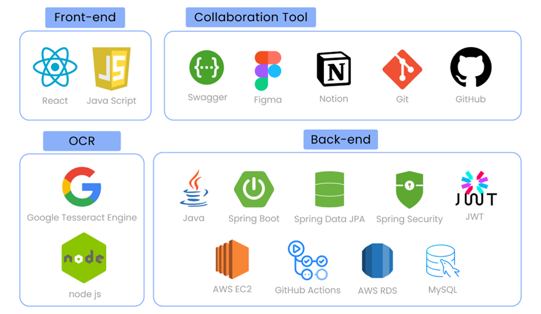
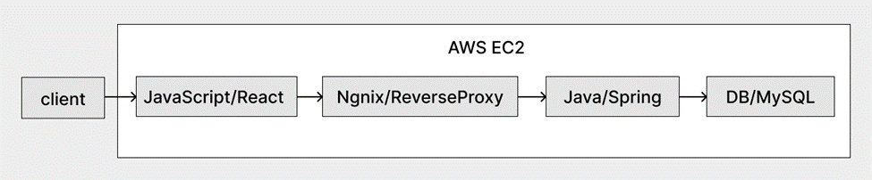
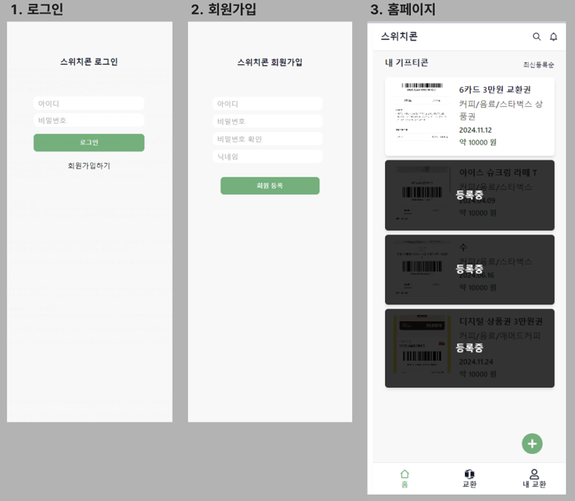
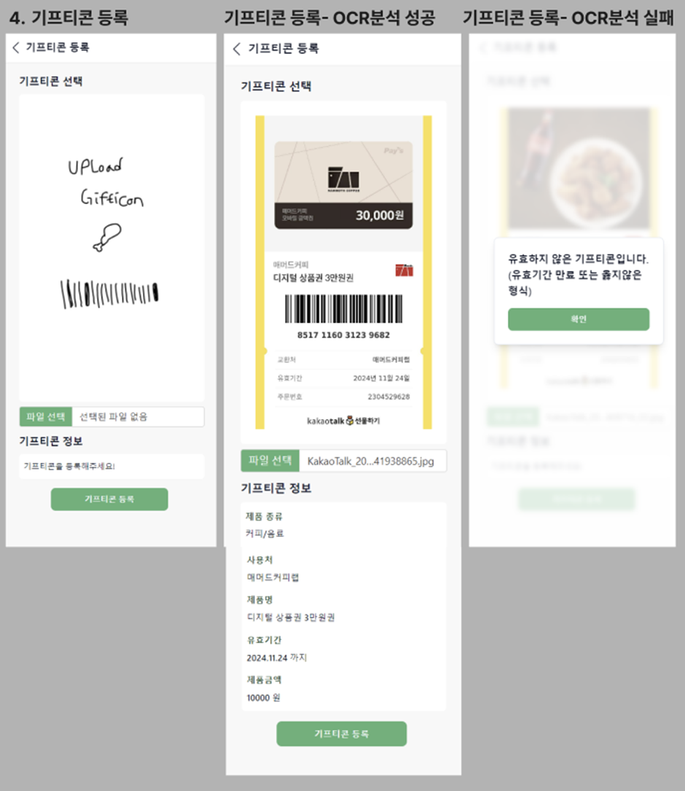
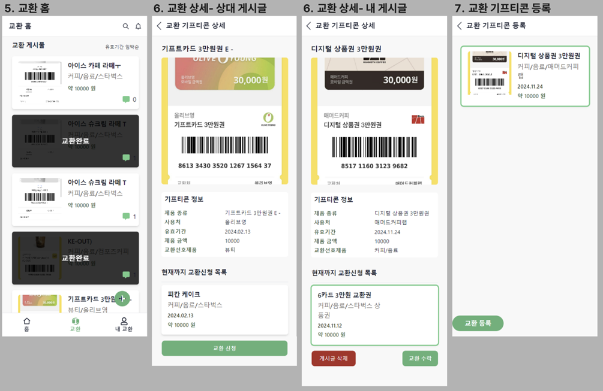
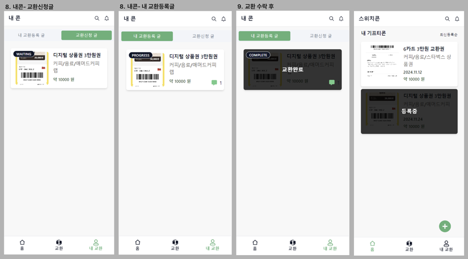

# 스위치콘 (SwitchCon)
> 스위치콘은 기프티콘 관리•교환•사용 웹 앱 서비스입니다. 모바일 상품권 시장이 급성장하면서 유효기간 만료로 인한 불편함을 겪고 있습니다. 특히 환불이나 기간 연장이 어려운 B2B 모바일 상품권과 원치 않는 기프티콘 처분에 어려움을 겪는 사람들이 많아지고 있습니다. 이러한 문제를 해결하기 위해, 흩어져 있는 기프티콘을 통합 관리하고, 사용자의 위치를 기반으로 사용처를 안내하며, 기프티콘 간 교환을 가능하게 하는 플랫폼 '스위치콘' 프로젝트가 기획하였습니다.

- `개발기간`: 2023.11.21 - 2023.12.10
- `팀 원`: 프론트 2명, 백엔드 2명 


## 담당 역할
- 프로젝트 총괄 
- UI&UX 디자인 및 구현 (메인 페이지, 교환하기 페이지, 기프티콘 등록페이지 등)
- OCR 서버 api 연결
- 최종보고서 작성

## 시작 가이드
  ```sh
npm install
```
로컬 실행 
```sh
npm run start
```
빌드 및 배포
- github pages를 이용하여 배포하였음
- `npm run deploy` 시 `gh-page` 브랜치로 빌드파일이 업데이트 됨
- https://github.com/switchcon/switchcon-front/tree/gh-pages 해당 레포지토리 `gh-page` 
- `baseURL` 변경 시, index.tsx에 basename={process.env.PUBLIC_URL}를 반드시 작성해야 함
- `package.json`에서 hompage에 baseURL을 작성해주면 됩니다.


## 개발환경 



## 실제 화면





## 주요기능
📍OCR 기반 기프티콘 유효성 검사
- 새로 등록할 기프티콘에 대해 유효기간이 현재 날짜로부터 유효한지 검사한 후 등록합니다.
- 이는 클라이언트에서 파일업로드 후, OCR 서버에 파일을 보내 텍스트 분석을 마친 결과를 받아 유효성을 확인하는 로직입니다.
📍지도로 보는 내 주변 기프티콘 사용처
- 등록된 기프티콘의 사용처 중 사용자 위치와 가까운 곳을 지도로 보여줍니다.
- 현재는 API Key가 만료되어 실행이 불가합니다.

## 유저 케이스


## 파일구조
```sh
src
 ┣ api # 서버 연결 api 
 ┃ ┣ ExchangeAPI.tsx
 ┃ ┣ GiftconAPI.tsx
 ┃ ┗ UserApi.tsx
 ┣ assets #이미지 에셋
 ┃ ┗ images
 ┣ components
 ┃ ┗ ui #공용컴포넌트
 ┃ ┃ ┣ alert-dialog.tsx
 ┃ ┃ ┣ badge.tsx
 ┃ ┃ ┣ button.tsx
 ┃ ┃ ┣ Common.tsx
 ┃ ┃ ┣ ExchangeReqCard.tsx
 ┃ ┃ ┣ Footer.tsx
 ┃ ┃ ┣ GiftCard.tsx
 ┃ ┃ ┣ Header.tsx
 ┃ ┃ ┣ select.tsx
 ┃ ┃ ┗ tabs.tsx
 ┣ functions
 ┃ ┗ base64Decoding.ts
 ┣ lib 
 ┃ ┣ kakaoMap.js # 교환 상세페이지에 보여줄 카카오맵
 ┃ ┣ state.ts
 ┃ ┗ utils.ts
 ┣ pages
 ┃ ┣ exchange
 ┃ ┃ ┣ ExchangeHome.tsx  #교환 홈페이지
 ┃ ┃ ┣ ExchangePostCreate.tsx #교환 요청 작성페이지
 ┃ ┃ ┣ ExchangePostDetail.tsx #교환게시물 상세페이지
 ┃ ┃ ┗ ExchangeRequest.tsx #교환요청 페이지
 ┃ ┣ giftCon
 ┃ ┃ ┣ GiftconPostDetail.tsx #내 기프티콘 상세페이지
 ┃ ┃ ┗ GiftConRegister.tsx #기프티콘 등록페이지 
 ┃ ┣ login
 ┃ ┃ ┣ Login.tsx #로그인페이지
 ┃ ┃ ┗ Signup.tsx #회원가입페이지
 ┃ ┣ mainPage
 ┃ ┃ ┣ Home.tsx #메인페이지
 ┃ ┃ ┗ Landing.tsx
 ┃ ┗ myExchange
 ┃ ┃ ┗ MyExchange.tsx #내 교환목록페이지
 ┣ App.tsx
 ┣ index.css
 ┗ index.tsx
```

### 회고
이번 프로젝트를 진행하면서, 짧은 기간 내에 완성도를 높이기 위해 주요 기능에 우선순위를 두고 개발하는 것이 중요하다는 것을 다시 한 번 느꼈습니다. 초기 단계에서 설계와 기획에 많은 시간을 투자한 결과, 전체적인 구조와 방향성은 명확하게 설정할 수 있었지만, 그만큼 실제 개발에 할애할 시간이 부족해지는 상황이 발생했습니다. 특히, 계획했던 일정 내에 모든 기능을 구현하는 데 어려움을 겪으면서, 기능 구현의 우선순위를 명확하게 정하고, 핵심 기능부터 완성하는 전략이 필요했음을 깨달았습니다.

결과적으로, 시간이 부족한 상황에서 모든 기능을 완벽하게 구현하지 못해 아쉬움이 남지만, 이번 경험을 통해 프로젝트 관리와 개발 일정의 중요성을 다시 한 번 인식하게 되었습니다. 앞으로는 설계와 기획 단계에서 주요 기능에 대한 우선순위를 더욱 명확히 하고, 그에 따라 개발 일정을 세밀하게 조정해 나가는 것이 필요할 것 같습니다. 이와 같은 경험이 다음 프로젝트에서는 더 나은 결과를 도출하는 데 큰 도움이 될 것이라 생각합니다.
